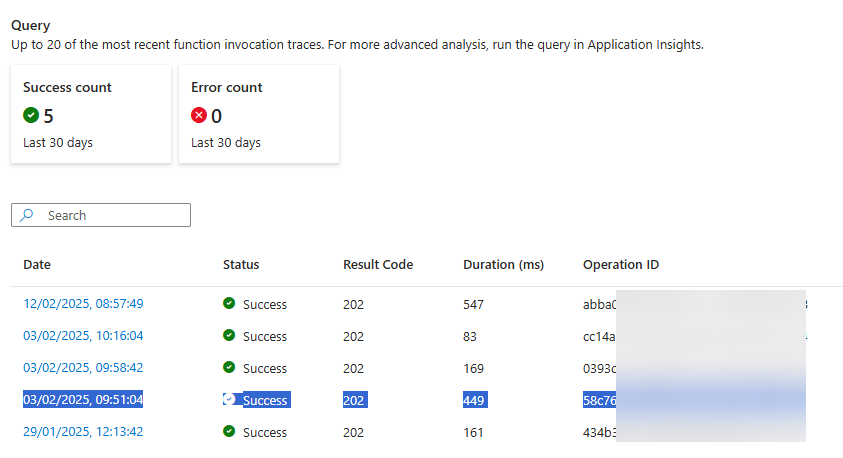
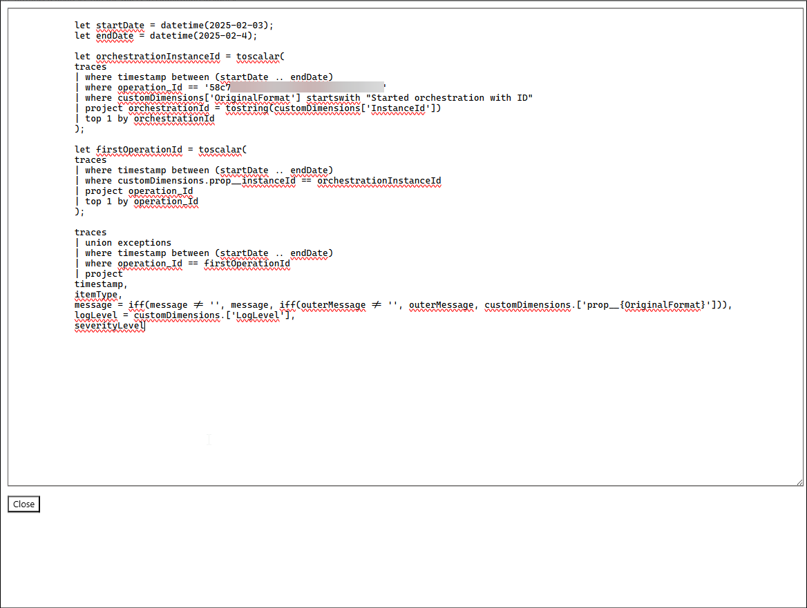

# Get distributed trace Kusto query

This bookmarklet helps generating a Kusto query to get all events related to an orchestation.
Comes with some instructions:

1. Go to the Azure Portal, to the Invocations of the Azure Function that starts the Orchestration you want to trace.
2. Select the row of the invocation you want to analyze and copy the row to the clipboard (Ctrl+C)

3. Click the bookmarklet, you are presented with a Kusto query that you can copy and paste into the Azure Application Insights Logs, it by default is filtered by the date the HTTP event occurred and the day after, adjust if the full orchestration took longer than 1 day.

[!code-javascript]

